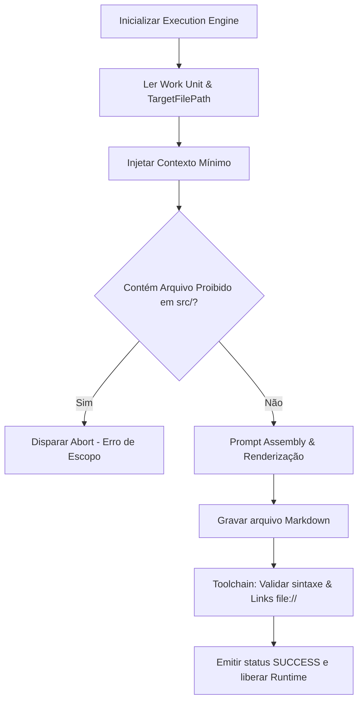

# Documentation Capability: Manual Operacional de Runtime (v3-capability-documentation-runtime)

Este documento estabelece o manual operacional definitivo de tempo de execução da **Documentation Capability** (`v3-capability-documentation`) no ecossistema da Framework Engine V3.0.

---

## 📥 Entradas (Inputs)

O runtime da Documentation Capability consome um conjunto de dados isolado provido pelo Context Builder:
1. **Work Unit Ativa (WU):** O arquivo contendo a definição da tarefa, critérios de aceitação e caminhos de arquivos de destino em `.ai-workspace/specifications/active/`.
2. **Context Payload Hidratado:** Contendo os arquivos obrigatórios de regras do framework ([always-read.md](file:///C:/Users/lucas/Projetos/Boilerplate-v2/.agents/rules/always-read.md) e [DOCUMENTATION_GUIDELINES.md](file:///C:/Users/lucas/Projetos/Boilerplate-v2/docs/guides/DOCUMENTATION_GUIDELINES.md)).
3. **Templates de Documentação:** Templates de referência em `.ai-workspace/templates/` (se houver).
4. **Assinaturas de Código (Opcional/Passivo):** Código-fonte bruto referenciado na Work Unit, carregado apenas como leitura conceitual estrita.

---

## 📤 Saídas (Outputs)

O processador de escrita emite:
1. **Documento Markdown Resultante:** Arquivo estruturado (.md) gerado ou editado no caminho físico de destino declarado no planejamento.
2. **Status de Execução:** Relatório estruturado de gravação (`SUCCESS` ou `FAILED`) alimentado diretamente no Runtime State.
3. **Dados de Logs:** Metadados detalhando o consumo de tokens de contexto e tamanho físico (linhas) do arquivo gerado.

---

## 🔄 Fluxo Operacional

O pipeline de micro-execução é composto pela sequência ordenada abaixo:



### Detalhamento das Etapas

1. **Recepção da Work Unit:** A capability lê o arquivo de Work Unit ativa de onde extrai o `TargetFilePath` e o `SpecificationSource`.
2. **Injeção de Contexto:** O Context Builder limita a injeção ao orçamento máximo de tokens (8.000 tokens) e carrega os guias de estilo.
3. **Fronteira de Escopo:** A capability audita o plano e valida que não há caminhos de gravação direcionados para pastas de código (`src/`, `config/`, etc.). Caso detecte desvio, aciona abortamento imediato.
4. **Renderização de Markdown:** A Execution Engine preenche as seções exigidas pela Work Unit utilizando a sintaxe GitHub Flavored Markdown (GFM).
5. **Auditoria de Toolchain:** O Toolchain Gateway rodando no ambiente do desenvolvedor verifica links e a estrutura física dos documentos.
6. **Descarte e Fechamento:** O Result Processor limpa o buffer volátil do Runtime State.

---

## 🚫 Restrições de Runtime

* **Proibição de Código Físico:** É expressamente proibido alterar arquivos `.tsx`, `.ts`, `.js`, `.css`, ou configurações. Qualquer violação causa rollback automático e cancelamento imediato da transação pelo Result Processor.
* **Proibição de Comandos do Sistema:** A capability não pode executar scripts ou subprocessos que interajam com rede ou alterem o sistema do desenvolvedor.
* **Foco Territorial de Documentos:** A escrita está autorizada exclusivamente para arquivos Markdown (.md) nas pastas de documentação, logs e especificações do projeto.

---

## 📦 Exemplo de Payload de Runtime

O JSON abaixo detalha a estrutura de parâmetros da transação de execução:

```json
{
  "transactionId": "tx_doc_runtime_203",
  "workUnit": {
    "id": "WU-024",
    "domain": "documentation",
    "title": "Gerar documentação operacional do sistema"
  },
  "runtimeInputs": {
    "targetFilePath": "C:/Users/lucas/Projetos/Boilerplate-v2/.agents/capabilities/documentation-runtime.md",
    "specificationSource": "C:/Users/lucas/Projetos/Boilerplate-v2/.ai-workspace/specifications/documentation-runtime.md",
    "mandatoryContext": [
      "C:/Users/lucas/Projetos/Boilerplate-v2/.agents/rules/always-read.md",
      "C:/Users/lucas/Projetos/Boilerplate-v2/docs/guides/DOCUMENTATION_GUIDELINES.md"
    ]
  },
  "runtimeOutputs": {
    "status": "SUCCESS",
    "writtenFiles": [
      "C:/Users/lucas/Projetos/Boilerplate-v2/.agents/capabilities/documentation-runtime.md"
    ]
  }
}
```
