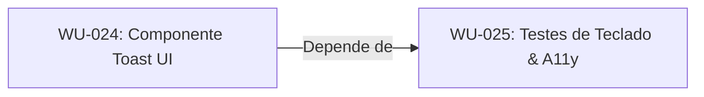

# Exemplo Real de Execução: Planning Capability

Este documento demonstra o funcionamento prático da **Planning Capability** (`v3-capability-planning`), apresentando a transformação de uma Specification de entrada fictícia em um Plano de Execução completo contendo Work Units ordenadas e estruturadas.

---

## 📥 1. Specification de Entrada (Input)
A especificação abaixo foi enviada ao Control Plane no arquivo `.ai-workspace/specifications/notification-toast.md`:

```markdown
# Specification: Sistema de Alertas Toast Acessíveis

## Objetivo
Criar um componente de alerta temporário (Toast Notification) para exibir feedbacks de ações do sistema (sucesso, erro, alerta).

## Escopo Técnico
1. Desenvolver o componente visual Toast com suporte a cores e ícones correspondentes a cada tipo de alerta.
2. Integrar com o Tailwind CSS v4 para aplicar efeitos de animação (slide-in / slide-out).
3. Garantir compatibilidade com leitores de tela usando marcação ARIA dinâmica (`role="alert"`).
4. Implementar testes de interação por teclado para fechar o toast pressionando `Esc`.

## Restrições
Proibido instalar bibliotecas externas de toast. Utilizar apenas as dependências core.
```

---

## 🔄 2. Processamento da Planning Capability

A capability analisa a entrada, realiza a triagem de domínios e a classificação de esforço em tempo de execução:
* **Objetivo Mapeado:** Centralizar feedbacks visuais temporários e acessíveis do sistema.
* **Complexidade Computada:** `Small Feature` (alteração contida em componente de UI sem persistência de banco).
* **Domínios Técnicos Identificados:** `UI`, `Testing`, `Documentation`.

---

## 📤 3. Plano de Execução Produzido (Output)

A capability grava o plano estruturado no arquivo `.ai-workspace/roadmaps/notification-toast-plan.md`:

```markdown
# Plano de Execução: Sistema de Alertas Toast Acessíveis

## 📋 Resumo do Planejamento
* **Complexidade:** Small Feature
* **Quantidade de Work Units:** 2
* **Domínios Envolvidos:** UI, Testing, Documentation
* **Risco Técnico:** Alto risco de quebra de acessibilidade caso o foco de teclado não seja devidamente manipulado ao fechar o componente Toast.

---

## 🗺️ Sequenciamento e Dependências



---

## 📦 Detalhamento das Work Units

### Work Unit 1: Componente Toast UI
* **ID:** `WU-024`
* **Capability Responsável:** `v3-capability-ui`
* **Objetivo:** Criar a estrutura e estilos visuais do componente Toast utilizando Tailwind CSS v4.
* **Critérios de Aceite:**
  * Renderizar toasts individuais com cores correspondentes (Verde para sucesso, Vermelho para erro).
  * Exibir o ícone correspondente à severidade do alerta.
  * Ocultar automaticamente o componente após 5 segundos de exibição.
* **Arquivos previstos:**
  * `src/components/ui/Toast.tsx` (criação)
  * `src/components/ui/Toast.css` (criação)

### Work Unit 2: Testes de Teclado & A11y
* **ID:** `WU-025`
* **Capability Responsável:** `v3-capability-testing`
* **Objetivo:** Adicionar cobertura de testes de regressão de tela para validação de atalhos e acessibilidade ARIA.
* **Critérios de Aceite:**
  * O leitor de tela deve anunciar instantaneamente o toast ao ser disparado (`role="alert"` ou `aria-live="assertive"`).
  * O toast deve ser fechado imediatamente ao pressionar a tecla `Esc`.
  * Validação física do comando de testes locais.
* **Arquivos previstos:**
  * `src/components/ui/Toast.test.tsx` (criação)
```

---

## 🏁 4. Julgamento do Result Processor
O Result Processor verifica que a Planning Capability cumpriu o contrato de zero escrita de código em `src/`, validou a linearidade do grafo de tarefas e gerou arquivos de Work Unit estruturados com base no template oficial. O processor consolida a transação e atualiza o histórico em [PROJECT_STATE.md](file:///C:/Users/lucas/Projetos/Boilerplate-v2/docs/history/PROJECT_STATE.md).
