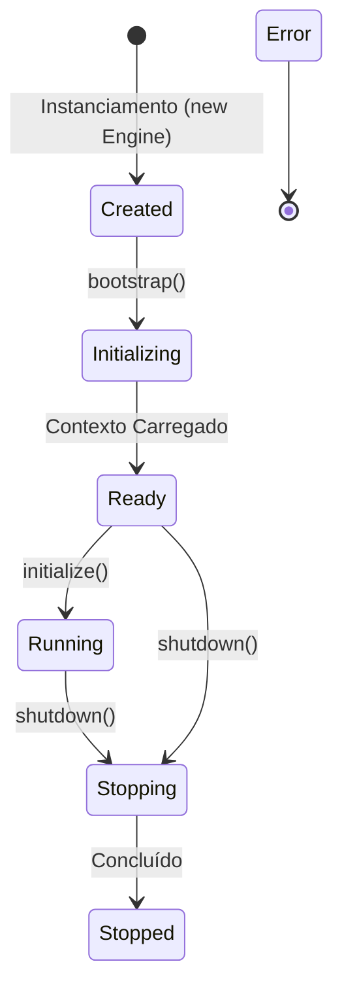

# Relatório Técnico de Execução — Sprint V3.1-03 (Engine Core Bootstrap)

Este relatório técnico documenta a homologação e a validação em tempo de execução da **Sprint V3.1-03**, focada na implementação física do núcleo, interface de configurações e controle de ciclo de vida da Framework Engine no repositório **framework-engine**.

---

## 📂 Arquivos Criados

Os seguintes arquivos de núcleo foram criados sob `src/core/` e no index de entrada:
*   `src/core/EngineStatus.ts` — Enumeração TypeScript contendo todos os estados operacionais lógicos.
*   `src/core/EngineConfig.ts` — Interface contendo as propriedades estáticas de configuração inicial da Engine.
*   `src/core/EngineContext.ts` — Classe para armazenamento e compartilhamento de contexto interno.
*   `src/core/Engine.ts` — Classe principal orquestradora do ciclo de vida lógica.
*   `src/index.ts` — Ponto de entrada do pacote reconfigurado para exportar os quatro componentes principais.

---

## 📊 Diagrama do Ciclo de Vida da Engine

O fluxo de transições de estados e transições de ciclo de vida lógicas obedece à máquina de estados abaixo:



---

## ⚙️ Estados Implementados

O ciclo de vida conta com 7 estados estruturais definidos no `EngineStatus`:
1.  **`Created`:** A Engine foi instanciada com as configurações, mas seus barramentos lógicos não foram inicializados.
2.  **`Initializing`:** O processo de `bootstrap` está em andamento (montando contextos e dependências internas).
3.  **`Ready`:** A Engine concluiu a triagem inicial e encontra-se pronta para iniciar a esteira operacional.
4.  **`Running`:** O pipeline ativo encontra-se processando tarefas físicas no repositório.
5.  **`Stopping`:** O processo de encerramento (`shutdown`) foi acionado.
6.  **`Stopped`:** A Engine liberou todos os recursos e encerrou a execução de forma limpa.
7.  **`Error`:** Estado de travamento em caso de incidentes lógicos ou violações de segurança territorial.

---

## 📦 Estrutura Pública Exportada

O ponto de entrada de exportação `src/index.ts` disponibiliza as seguintes assinaturas públicas:

```typescript
export { Engine } from './core/Engine.js';
export { EngineStatus } from './core/EngineStatus.js';
export { EngineConfig } from './core/EngineConfig.js';
export { EngineContext } from './core/EngineContext.js';
```

---

## 🏁 Confirmação de Compilação

As checagens locais por compilador foram executadas na pasta de projetos independente com sucesso:
*   **Build do Pacote:** `npm run build` executado e finalizado com sucesso absoluto (gerou os arquivos JS na pasta `/dist/` contendo arquivos com mapeamento de declarações TypeScript e mapas de fontes).
*   **Checagem Estática de Tipos:** `npm run typecheck` completou com **zero erros de tipagem**.
