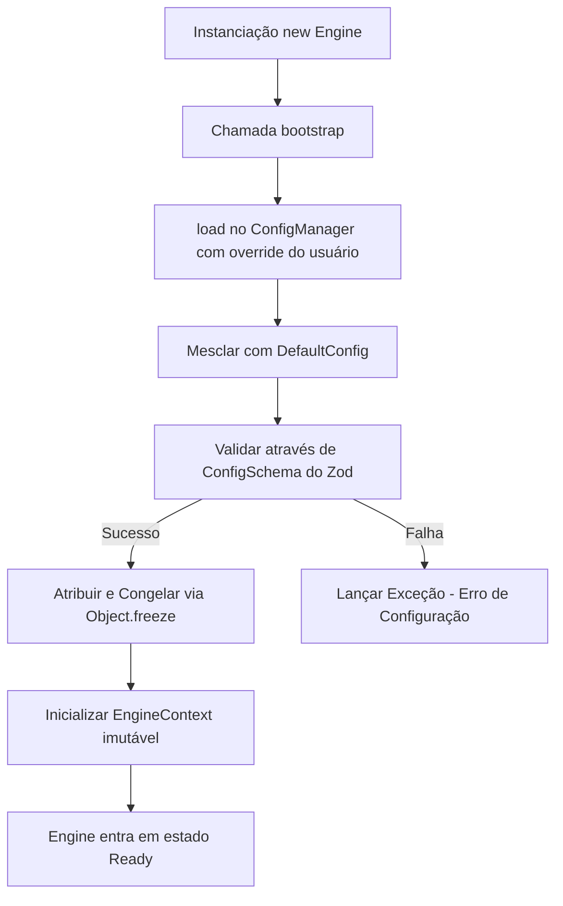

# Relatório Técnico de Execução — Sprint V3.1-04 (Configuration Manager)

Este relatório técnico documenta a homologação e a validação em tempo de execução da **Sprint V3.1-04**, focada no desenvolvimento físico do módulo de gerenciamento de configurações estáticas e dinâmicas da Engine no repositório **framework-engine**.

---

## 🏛️ Arquitetura Criada

O módulo de configurações foi encapsulado na subpasta `src/core/config/` de forma desacoplada dos outros componentes da Engine:
*   `src/core/config/ConfigSchema.ts` — Define o schema Zod e tipo estático para as propriedades da Engine.
*   `src/core/config/DefaultConfig.ts` — Exporta os valores padrão da Engine (logLevel, maxRetries, dryRun, etc.).
*   `src/core/config/ConfigManager.ts` — Classe responsável pelo carregamento em memória, merge, validação e congelamento (imutabilidade estrita) da configuração.

---

## 📊 Diagrama do Fluxo de Configuração

O fluxo de carga de configuração obedece ao seguinte encadeamento lógico durante o bootstrap da Engine:

---

## ⚙️ Validações Implementadas (Zod Schema)

Toda propriedade de configuração passa de forma obrigatória pelo schema Zod em `ConfigSchema.ts`:
1.  **`workspacePath`:** Obrigatório (string não vazia).
2.  **`capabilitiesPath`:** Obrigatório (string não vazia).
3.  **`documentationPath`:** Obrigatório (string não vazia).
4.  **`docsPath`:** Opcional (string). Fallback automático para `documentationPath` caso omitido.
5.  **`verbose` & `debug` & `dryRun`:** Opcionais (boolean). Default: `false`.
6.  **`logLevel`:** Opcional (enum: `'debug' | 'info' | 'warn' | 'error'`). Default: `'info'`.
7.  **`maxRetries`:** Opcional (inteiro não-negativo). Default: `3`.

Qualquer tentativa de alteração direta nos dados após o bootstrap dispara uma exceção imediata (`ConfigManager is read-only.`).

---

## 🏁 Resultados e Confirmação dos Testes

Criamos e executamos a suíte de testes locais em `tests/EngineConfig.test.ts` via `npm run test` com sucesso absoluto:
*   **[Teste 1] Inicialização com override válido:** PASSOU. Carrega os padrões e aplica os overrides corretamente no ConfigManager.
*   **[Teste 2] Verificação de Imutabilidade pós-bootstrap:** PASSOU. O método `.set()` lança a exceção esperada (`Cannot modify configuration. ConfigManager is read-only.`) ao tentar alterar propriedades pós-congelamento.
*   **[Teste 3] Verificação de Validação do Zod:** PASSOU. Dispara exceção (`Invalid Engine configuration`) ao inicializar com chaves em branco ou valores fora de regras (como `maxRetries` negativo).
*   **Compilação & Tipagem:** `npm run build` e `npm run typecheck` completados com zero erros.
