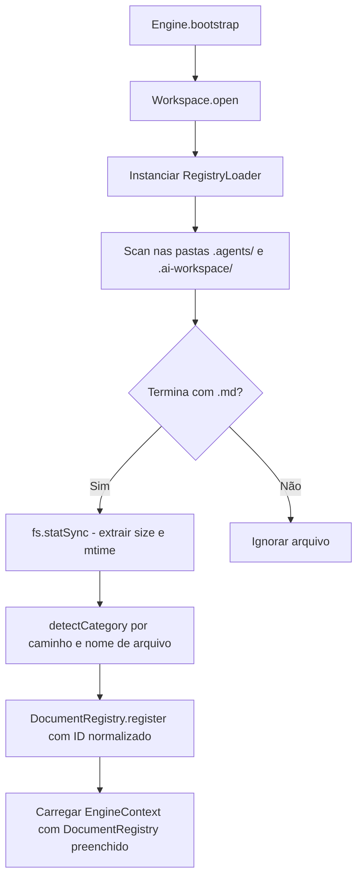

# Relatório Técnico de Execução — Sprint V3.1-06 (Document Registry)

Este relatório técnico documenta a homologação e a validação em tempo de execução da **Sprint V3.1-06**, focada no desenvolvimento do catálogo físico e indexador estático de documentos Markdown contidos nas pastas `.agents/` e `.ai-workspace/` do workspace consumidor.

---

## 🏛️ Arquitetura Criada

O módulo foi estruturado na subpasta `src/core/registry/` do repositório **framework-engine**:
*   `src/core/registry/DocumentCategory.ts` — Enumeração definindo as categorias funcionais de cada documento cognitivo.
*   `src/core/registry/Document.ts` — Interface representando as propriedades e metadados de arquivos.
*   `src/core/registry/DocumentRegistry.ts` — Mapa de armazenamento em memória que indexa e gerencia os documentos por chaves.
*   `src/core/registry/RegistryLoader.ts` — Driver recursivo encarregado de escanear o workspace, detectar arquivos `.md`, extrair metadados físicos e cadastrar no registry com classificação automatizada.

---

## 📊 Diagrama do Document Registry

O processo de indexação opera sob a seguinte topologia de dados:

---

## 📊 Métricas de Indexação Real

Após a varredura física executada no workspace consumidor (**Boilerplate-v2**), obtivemos os seguintes resultados:
*   **Total de Documentos Indexados:** 244 arquivos Markdown.
*   **Categorias Identificadas:**
    1.  `Capabilities` (ex: plugins e capabilities oficiais)
    2.  `Rules` (regras cognitivas e de conduta de IA)
    3.  `Specifications` (especificações de runtime)
    4.  `Templates` (templates de Work Units e relatórios)
    5.  `Knowledge` (skills locais e acervo de A11y)
    6.  `Logs` (relatórios históricos de sprints)
    7.  `Roadmaps` (fases estruturais da V3)
    8.  `Other` (documentos gerais na raiz das pastas)

---

## 🏁 Confirmação dos Testes Locais

Criamos e executamos a suíte de testes locais em `tests/EngineRegistry.test.ts` via `npm run test` com sucesso absoluto:
*   **[Teste 1] Indexação Física:** PASSOU. Descobre 244 arquivos legítimos e valida caminhos absolutos e relativos.
*   **[Teste 2] Categorias Detectadas:** PASSOU. Associa corretamente as categorias com base nos padrões de pastas.
*   **[Teste 3] Bloqueio de Duplicidade:** PASSOU. Lança a exceção esperada (`is already registered`) ao tentar reinserir o mesmo documento no catálogo.
*   **[Teste 4] Arquivos Inexistentes:** PASSOU. Retorna `undefined` em pesquisas por caminhos fantasmas.
*   **[Teste 5] Busca por Categoria:** PASSOU. Filtra corretamente os arquivos (ex: 76 documentos em `Rules`).
*   **[Teste 6] Busca por ID:** PASSOU. Retorna a assinatura correta de metadados do documento consultado.
*   **Compilação & Tipos:** `npm run build` e `npm run typecheck` completados com zero erros.
