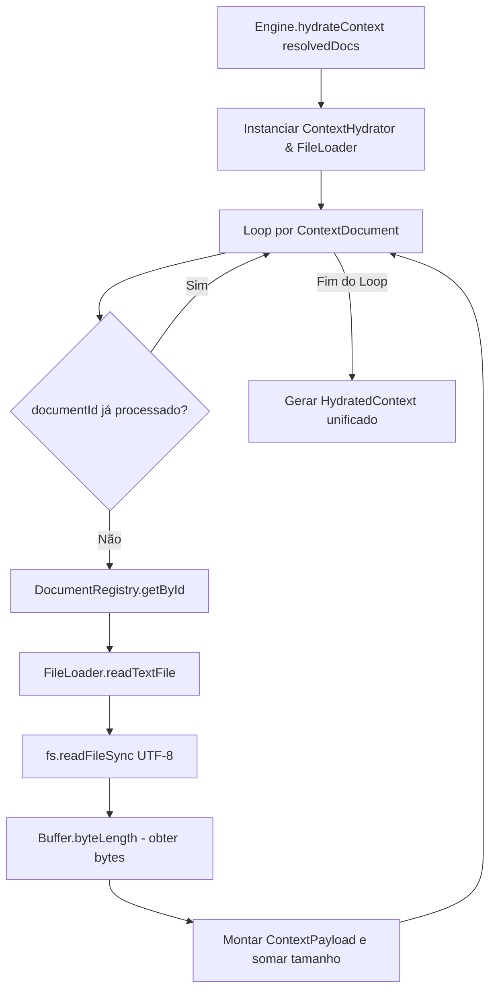

# Relatório Técnico de Execução — Sprint V3.1-08 (Context Hydrator)

Este relatório técnico documenta a homologação e a validação em tempo de execução da **Sprint V3.1-08**, focada na implementação do módulo de hidratação física de documentos, que lê os arquivos indexados de forma sequencial em UTF-8 no repositório **framework-engine**.

---

## 🏛️ Arquitetura Criada

O módulo de carregamento de arquivos foi criado na pasta `src/core/context/`:
*   `src/core/context/ContextPayload.ts` — Interface contendo o formato do documento lido em memória (com caminho, título, conteúdo e metadados de prioridade).
*   `src/core/context/HydratedContext.ts` — Interface representando a estrutura unificada final contendo a lista de documentos e métricas de bytes/caracteres.
*   `src/core/context/FileLoader.ts` — Driver isolador de leitura de arquivos em UTF-8 com barreira territorial contra Path Traversal.
*   `src/core/context/ContextHydrator.ts` — Classe que consome `ContextDocument[]`, purga repetições, usa o `FileLoader` para carregar o conteúdo físico dos arquivos e consolida o `HydratedContext`.

---

## 📊 Diagrama de Fluxo de Hidratação de Contexto

O loop físico de carga de arquivos obedece à esteira sequencial abaixo:



---

## 📄 Exemplo de Payload Hidratado em Memória

Abaixo está a estrutura simplificada de um documento retornado no `HydratedContext.documents`:

```json
{
  "id": ".agents/rules/always-read.md",
  "path": ".agents/rules/always-read.md",
  "category": "Rules",
  "title": "always-read.md",
  "content": "# Regra Geral de Conduta IA\nToda resposta do assistente deve estar em Português-BR...",
  "priority": 10,
  "required": true
}
```

---

## 📈 Métricas de Leitura Real (Workspace do Boilerplate-v2)

Para uma requisição de planejamento contendo os 3 primeiros documentos resolvidos:
*   **Quantidade de Documentos Carregados:** 3 arquivos `.md`.
*   **Total de Caracteres Carregados:** 10.730 caracteres.
*   **Tamanho Acumulado em Memória:** 11.102 bytes.

---

## 🏁 Resultados e Confirmação dos Testes

Executamos a suíte de testes locais em `tests/EngineHydrator.test.ts` via `npm run test` com sucesso absoluto:
*   **[Teste 1] Leitura de Arquivos (UTF-8):** PASSOU. Lê com sucesso os arquivos físicos, acumulando caracteres/bytes e resgatando strings de conteúdo corretas.
*   **[Teste 2] Preservação de Ordem:** PASSOU. Mantém integralmente a ordenação decrescente de prioridades estabelecida no resolvedor.
*   **[Teste 3] Eliminação de Duplicados:** PASSOU. Filtra repetições de forma robusta em tempo de execução.
*   **[Teste 4] Arquivo Inexistente:** PASSOU. Dispara erro controlado caso a ID consultada não possua cadastro correspondente de metadados.
*   **Compilação & Tipagem:** `npm run build` e `npm run typecheck` completados com zero erros.
