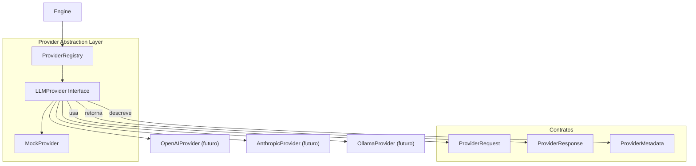

# Relatório Técnico de Execução — Sprint V3.1-10 (Provider Abstraction Layer)

Este relatório técnico documenta a homologação e validação da **Sprint V3.1-10**, na qual foi implementada a camada de abstração entre a Framework Engine e qualquer modelo de Linguagem (LLM), garantindo o desacoplamento total da Engine de provedores específicos como OpenAI, Anthropic, Gemini ou Ollama.

---

## 🏛️ Arquitetura Criada

O módulo foi criado na pasta `src/providers/` do repositório **framework-engine**:

| Arquivo | Tipo | Responsabilidade |
|---------|------|-----------------|
| `LLMProvider.ts` | Interface | Contrato único que toda integração futura deve implementar |
| `ProviderMetadata.ts` | Interface | Capacidades e identificação do provider |
| `ProviderRequest.ts` | Interface | Requisição padronizada enviada a qualquer provider |
| `ProviderResponse.ts` | Interface | Resposta padronizada retornada de qualquer provider |
| `ProviderRegistry.ts` | Classe | Catálogo em memória com registro, busca e provider padrão |
| `MockProvider.ts` | Classe | Implementação offline e determinística para testes |

---

## 📊 Diagrama da Camada de Abstração



---

## 📋 Contrato da Interface LLMProvider

```typescript
interface LLMProvider {
  generate(request: ProviderRequest): Promise<ProviderResponse>;
  stream(request: ProviderRequest, onChunk: (chunk: string) => void): Promise<ProviderResponse>;
  health(): Promise<boolean>;
  metadata(): ProviderMetadata;
}
```

Qualquer integração futura (OpenAI, Anthropic, Gemini, Ollama) deverá **exclusivamente** implementar esta interface. A Engine jamais importará SDKs de provedores diretamente.

---

## 📄 Exemplo de Uso

```typescript
const engine = new Engine(config);
await engine.bootstrap();

// Registrar o MockProvider (para testes) — ou qualquer provider real no futuro
const mock = new MockProvider();
engine.registerProvider(mock);
engine.setDefaultProvider('mock');

// Executar geração via interface abstrata
const provider = engine.getDefaultProvider();
const response = await provider.generate({
  prompt: prompt.context + "\n\n" + prompt.instructions,
  temperature: 0.7,
  maxTokens: 2048
});

console.log(response.content);
// [MockProvider] Resposta determinística gerada.
// Prompt recebido com 18277 caracteres.
// Temperature: 0.7 | MaxTokens: 2048
```

---

## 🏁 Confirmação dos Testes (9 testes)

Executados via `npm run test` com sucesso absoluto:

*   **[Teste 1] Registro de provider:** PASSOU — MockProvider registrado e localizado no registry.
*   **[Teste 2] Provider padrão:** PASSOU — definido e recuperado corretamente.
*   **[Teste 3] Duplicidade bloqueada:** PASSOU — segundo registro do mesmo ID lança erro controlado.
*   **[Teste 4] generate() determinístico:** PASSOU — 37 tokens, 0ms de latência, `finishReason: 'stop'`.
*   **[Teste 5] health():** PASSOU — retornou `true` corretamente.
*   **[Teste 6] metadata():** PASSOU — `id="mock"`, `type="mock"`, `maxContext=128000`.
*   **[Teste 7] stream() determinístico:** PASSOU — emitiu 6 chunks com conteúdo correto.
*   **[Teste 8] getProvider() por ID:** PASSOU — recuperação direta por string de ID.
*   **[Teste 9] Provider inexistente:** PASSOU — erro `"not found"` lançado corretamente.
*   **`npm run build`:** PASSOU — zero erros de compilação TypeScript.
*   **`npm run typecheck`:** PASSOU — zero erros de tipagem estática.
