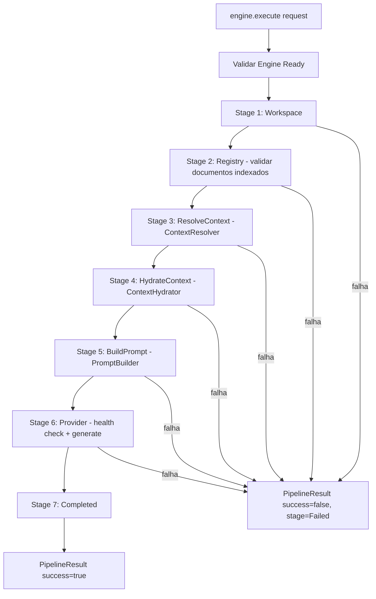

# Relatório Técnico de Execução — Sprint V3.1-11 (Engine Pipeline)

Este relatório técnico documenta a homologação e validação da **Sprint V3.1-11**, na qual foi implementado o `ExecutionPipeline`, o orquestrador determinístico central responsável por coordenar todos os módulos da Framework Engine V3.1 em uma única execução coesa.

---

## 🏛️ Arquitetura Criada

O módulo foi implementado na subpasta `src/core/pipeline/` do repositório **framework-engine**:

| Arquivo | Tipo | Responsabilidade |
|---------|------|-----------------|
| `PipelineStage.ts` | Enum | Define os 8 estágios possíveis do pipeline |
| `PipelineContext.ts` | Interface | Estado compartilhado e progressivo durante a execução |
| `PipelineResult.ts` | Interface | Resultado completo com sucesso, timestamps, duração e diagnósticos |
| `ExecutionPipeline.ts` | Classe | Orquestrador dos 7 estágios com isolamento de falhas por estágio |

---

## 📊 Diagrama do Pipeline de Execução



---

## 📄 Exemplo de Execução Completa

```typescript
const engine = new Engine({ workspacePath: '/projeto/boilerplate' });
await engine.bootstrap();

engine.registerProvider(new MockProvider());
engine.setDefaultProvider('mock');

const result = await engine.execute(
  { capability: "planning", workUnitType: "feature" },
  "Implementar autenticação OAuth2."
);

console.log(result.success);    // true
console.log(result.stage);      // 'Completed'
console.log(result.duration);   // 264ms
console.log(result.response?.content);
// [MockProvider] Resposta determinística gerada.
// Prompt recebido com X caracteres.
```

---

## 📈 Métricas de Execução Real (Boilerplate-v2, 249 docs indexados)

| Estágio | Tempo |
|---------|-------|
| Workspace | 0ms |
| Registry | 0ms |
| ResolveContext (184 docs selecionados) | 35ms |
| HydrateContext (leitura física UTF-8) | 226ms |
| BuildPrompt | 2ms |
| Provider (MockProvider) | 1ms |
| **Total Pipeline** | **264ms** |

---

## 🏁 Confirmação dos Testes (7 testes do Pipeline + 44 anteriores = 51 testes totais)

*   **[Teste 1] Pipeline completo:** PASSOU — `stage=Completed`, `success=true`, `duration=264ms`.
*   **[Teste 2] PipelineResult com resposta:** PASSOU — 219.802 tokens, `finishReason='stop'`.
*   **[Teste 3] Diagnósticos por estágio:** PASSOU — todos os 6 estágios com `status='ok'` e latências individuais.
*   **[Teste 4] Medição de duração:** PASSOU — timestamps `startedAt` e `finishedAt` corretos.
*   **[Teste 5] Falha por ausência de provider:** PASSOU — `success=false`, diagnóstico `_failedAt` registrado.
*   **[Teste 6] Erro sem bootstrap:** PASSOU — `"Engine is not ready to execute. Current status: Created."`.
*   **[Teste 7] Diagnósticos pré-erro:** PASSOU — estágios Workspace e Registry registrados como `'ok'` mesmo com Provider falhando.
*   **`npm run build`:** PASSOU — zero erros de compilação TypeScript.
*   **`npm run typecheck`:** PASSOU — zero erros de tipagem estática.
