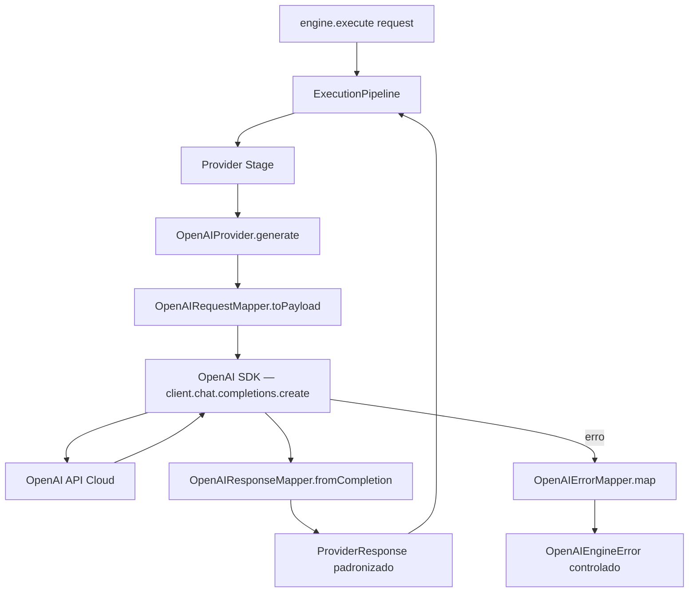

# Relatório Técnico de Execução — Sprint V3.1-12 (OpenAI Provider)

Este relatório técnico documenta a homologação e validação da **Sprint V3.1-12**, na qual foi implementada a integração real com a API da OpenAI através do primeiro `LLMProvider` de produção da Framework Engine V3.1.

---

## 🏛️ Arquitetura Criada

O módulo foi implementado na subpasta `src/providers/openai/` do repositório **framework-engine**:

| Arquivo | Tipo | Responsabilidade |
|---------|------|-----------------|
| `OpenAIConfig.ts` | Schema/Helper | Validação Zod da configuração, leitura de env vars, helper `isOpenAIConfigured()` |
| `OpenAIRequestMapper.ts` | Mapper | Converte `ProviderRequest` em payload da API Chat Completions |
| `OpenAIResponseMapper.ts` | Mapper | Converte resposta da OpenAI em `ProviderResponse` padronizado |
| `OpenAIErrorMapper.ts` | Mapper | Mapeia 7 tipos de erros HTTP/rede em `OpenAIEngineError` controlado |
| `OpenAIProvider.ts` | Provider | Implementa `LLMProvider` com `generate()`, `stream()`, `health()`, `metadata()` |

---

## 📊 Diagrama do Fluxo Request → Response



---

## ⚙️ Configuração do Provider

```bash
# Variáveis de ambiente suportadas:
OPENAI_API_KEY=sk-proj-...        # obrigatório
OPENAI_MODEL=gpt-4o-mini          # default: gpt-4o-mini
OPENAI_BASE_URL=https://api...    # opcional (para proxies/Azure)
OPENAI_ORGANIZATION=org-...       # opcional
```

```typescript
// Registro condicional automático — sem API Key, sem registro:
if (isOpenAIConfigured()) {
  const config = loadOpenAIConfig();
  engine.registerProvider(new OpenAIProvider(config));
  engine.setDefaultProvider('openai');
}
```

---

## 🛡️ Tabela de Erros Mapeados

| HTTP Status | `code` | Mensagem de Engine |
|-------------|--------|-------------------|
| 401 | `AUTH_ERROR` | Check your OPENAI_API_KEY |
| 403 | `FORBIDDEN` | API key may lack permissions |
| 404 | `NOT_FOUND` | Check your OPENAI_MODEL |
| 429 | `RATE_LIMIT` | Too many requests, retry later |
| 5xx | `SERVER_ERROR` | API temporarily unavailable |
| Timeout | `TIMEOUT` | Request timed out |
| Network | `NETWORK_ERROR` | Check internet connection |

---

## 🏁 Confirmação dos Testes (8 testes do OpenAI Provider + 51 anteriores = **59 testes totais**)

*   **[Teste 1] Configuração válida:** PASSOU — `model="gpt-4o-mini"`, `timeout=60000ms`.
*   **[Teste 2] Configuração inválida:** PASSOU — Zod rejeita `apiKey` vazia com erro tipado.
*   **[Teste 3] isOpenAIConfigured():** PASSOU — retornou `false` sem env var presente.
*   **[Teste 4] RequestMapper:** PASSOU — payload com 2 mensagens, `temp=0.5` mapeados corretamente.
*   **[Teste 5] ResponseMapper:** PASSOU — 15 tokens, 123ms, `finishReason='stop'` mapeados.
*   **[Teste 6] ErrorMapper:** PASSOU — todos os 7 códigos de erro mapeados corretamente.
*   **[Teste 7] metadata():** PASSOU — `id="openai"`, `type="cloud"`, `maxContext=128000`.
*   **[Teste 8] Registro condicional:** PASSOU — MockProvider registrado como fallback sem API Key.
*   **`npm run build`:** PASSOU — zero erros de compilação TypeScript.
*   **`npm run typecheck`:** PASSOU — zero erros de tipagem estática.
