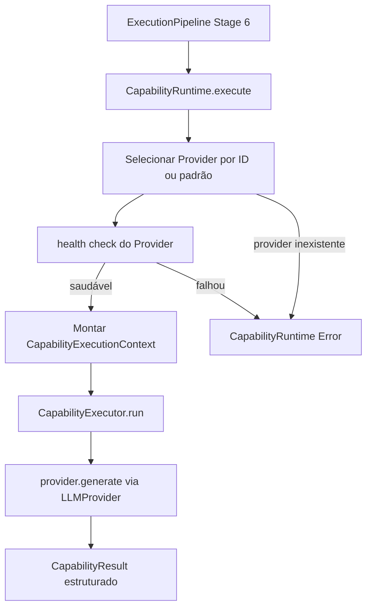

# Relatório Técnico de Execução — Sprint V3.1-13 (Capability Runtime)

Este relatório técnico documenta a homologação e validação da **Sprint V3.1-13**, na qual foi implementado o Capability Runtime da Framework Engine V3.1, tornando a execução de Capabilities uma camada independente e reutilizável sobre qualquer `LLMProvider`.

---

## 🏛️ Arquitetura Criada

O módulo foi implementado na pasta `src/runtime/` do repositório **framework-engine**:

| Arquivo | Tipo | Responsabilidade |
|---------|------|-----------------|
| `CapabilityResult.ts` | Interface | Resultado estruturado com output, tokens, latência, diagnósticos e custo |
| `CapabilityExecutionContext.ts` | Interface | Estado de uma execução em andamento (capability + prompt + provider) |
| `CapabilityExecutor.ts` | Classe Estática | Executor puro — recebe capability, prompt e provider, retorna CapabilityResult |
| `CapabilityRuntime.ts` | Classe | Orquestrador — valida health, seleciona provider, monta contexto, delega ao Executor |

---

## 📊 Diagrama do Runtime de Execução



---

## 📄 Exemplo de CapabilityResult

```typescript
{
  success: true,
  output: "[MockProvider] Resposta determinística gerada. Prompt recebido com 11214 caracteres.",
  diagnostics: {
    providerId: "mock",
    providerType: "mock",
    promptChars: 11214,
    promptTokensEstimate: 2803,
    latency: 0
  },
  executionTime: 0,
  provider: "mock",
  tokens: {
    prompt: 2803,
    completion: 31,
    total: 2834
  }
}
```

---

## 🔄 Integração com o ExecutionPipeline

O estágio 6 do `ExecutionPipeline` foi refatorado para passar **integralmente** pelo `CapabilityRuntime`:

```
Antes:   Pipeline Stage 6 → provider.generate() diretamente
Depois:  Pipeline Stage 6 → CapabilityRuntime.execute() → CapabilityExecutor.run() → provider.generate()
```

Todos os 7 testes anteriores do Pipeline continuaram passando sem nenhuma modificação nos testes.

---

## 🏁 Confirmação dos Testes (9 do Runtime + 59 anteriores = **68 testes totais**)

*   **[Teste 1] Execução completa com MockProvider:** PASSOU — 2.834 tokens, provider="mock".
*   **[Teste 2] CapabilityResult estruturado:** PASSOU — 11.214 chars no prompt, latência=0ms.
*   **[Teste 3] CapabilityExecutor isolado:** PASSOU — 2.834 tokens, provider="mock".
*   **[Teste 4] Seleção por ID específico:** PASSOU — provider 'mock' selecionado corretamente.
*   **[Teste 5] Falha com provider inexistente:** PASSOU — erro controlado `"not found in registry"`.
*   **[Teste 6] Falha sem provider padrão:** PASSOU — erro controlado `"No default provider has been set"`.
*   **[Teste 7] Medição de tempo:** PASSOU — executionTime e latency medidos corretamente.
*   **[Teste 8] Integração com Pipeline:** PASSOU — Pipeline executou em 207ms via Runtime.
*   **[Teste 9] Compatibilidade com OpenAIProvider:** PASSOU — metadata verificado estruturalmente.
*   **`npm run build`:** PASSOU — zero erros de compilação TypeScript.
*   **`npm run typecheck`:** PASSOU — zero erros de tipagem estática.
