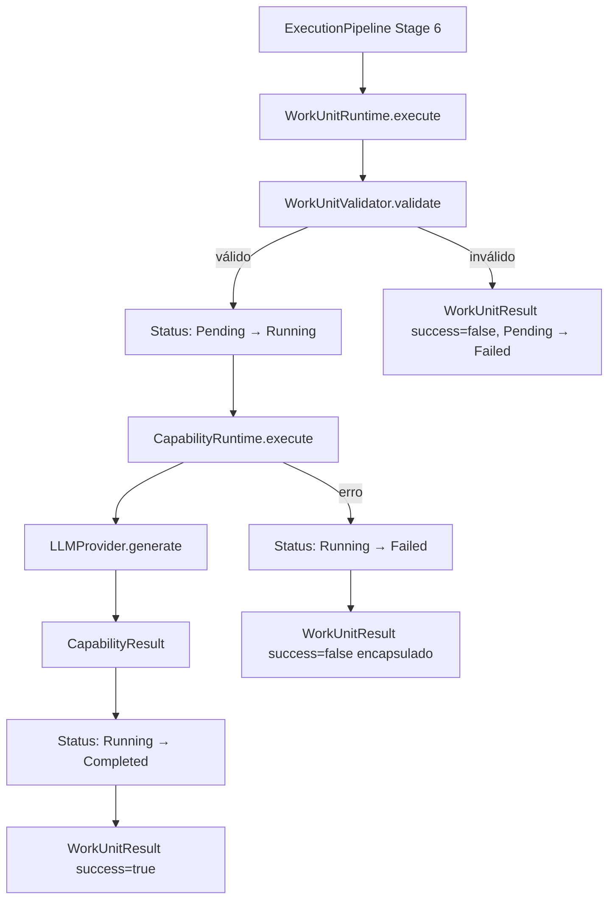

# Relatório Técnico de Execução — Sprint V3.1-14 (Work Unit Runtime)

Este relatório técnico documenta a homologação e validação da **Sprint V3.1-14**, na qual foi implementado o Work Unit Runtime da Framework Engine V3.1, tornando a execução de unidades atômicas de trabalho uma camada independente, validada e com gerenciamento completo de ciclo de vida.

---

## 🏛️ Arquitetura Criada

O módulo foi implementado na pasta `src/runtime/workunit/` do repositório **framework-engine**:

| Arquivo | Tipo | Responsabilidade |
|---------|------|-----------------|
| `WorkUnitStatus.ts` | Enum | 5 estados: Pending, Running, Completed, Failed, Cancelled |
| `WorkUnit.ts` | Interface | Representa uma unidade atômica de trabalho com id, capability, inputs e status |
| `WorkUnitResult.ts` | Interface | Resultado com capabilityResult, transições de estado e diagnósticos |
| `WorkUnitValidator.ts` | Classe | Valida campos obrigatórios com `WorkUnitValidationError` tipado |
| `WorkUnitRuntime.ts` | Classe | Orquestra validação, estados e execução via CapabilityRuntime |

---

## 📊 Diagrama do Work Unit Runtime



---

## 📄 Exemplo de WorkUnit

```typescript
const workUnit: WorkUnit = {
  id: 'wu-auth-001',
  title: 'Implementar Autenticação OAuth2',
  description: 'Criar fluxo completo de autenticação usando OAuth2 com PKCE.',
  capability: 'planning',
  inputs: { feature: 'auth', type: 'oauth2' },
  metadata: { sprint: 'V3.1-14' },
  status: WorkUnitStatus.Pending
};
```

---

## 📄 Exemplo de WorkUnitResult

```typescript
{
  success: true,
  workUnitId: 'wu-auth-001',
  capabilityResult: {
    output: '[MockProvider] Resposta determinística gerada...',
    tokens: { prompt: 2803, completion: 29, total: 2832 },
    provider: 'mock',
    executionTime: 1
  },
  executionTime: 1,
  diagnostics: {
    validationPassed: true,
    capabilityId: 'planning',
    statusTransitions: ['Pending', 'Running', 'Completed']
  }
}
```

---

## 🔄 Integração com o ExecutionPipeline

O estágio 6 foi expandido mais uma vez — agora a cadeia completa de execução é:

```
Pipeline Stage 6 → WorkUnitRuntime → CapabilityRuntime → CapabilityExecutor → LLMProvider
```

---

## 🏁 Confirmação dos Testes (8 do Work Unit + 68 anteriores = **76 testes totais**)

*   **[Teste 1] Execução completa:** PASSOU — 2.832 tokens, 1ms, provider="mock".
*   **[Teste 2] WorkUnitResult estruturado:** PASSOU — transições `Pending → Running → Completed`.
*   **[Teste 3] Transições de status:** PASSOU — sequência exata `[Pending, Running, Completed]`.
*   **[Teste 4] WorkUnitValidator válido:** PASSOU — WorkUnit válida aceita sem exceção.
*   **[Teste 5] Validação id ausente:** PASSOU — encapsulado no WorkUnitResult, `Pending → Failed`.
*   **[Teste 6] Validação capability ausente:** PASSOU — encapsulado no WorkUnitResult.
*   **[Teste 7] Falha por provider inexistente:** PASSOU — `Pending → Running → Failed` encapsulado.
*   **[Teste 8] Integração com Pipeline:** PASSOU — `153ms`, provider="mock".
*   **`npm run build`:** PASSOU — zero erros de compilação TypeScript.
*   **`npm run typecheck`:** PASSOU — zero erros de tipagem estática.
