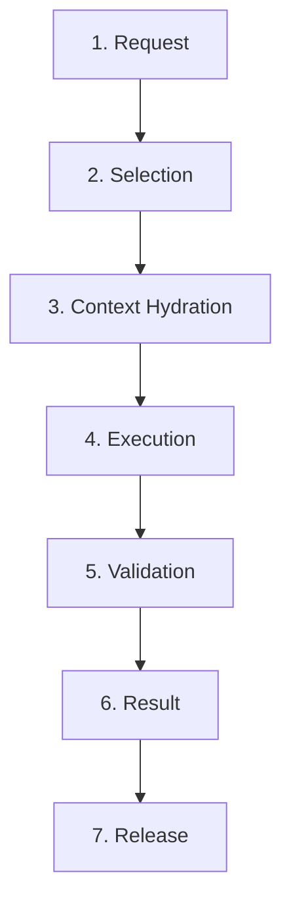

# Ciclo de Vida da Capability (Capability Lifecycle) — V3.0

Este documento define a especificação do ciclo de vida operacional de uma **Capability** em tempo de execução no AI Development Framework V3.0. Ele descreve as etapas lineares que ocorrem desde o momento de sua solicitação até a sua liberação e limpeza do contexto da IA.

---

## 🗺️ Etapas do Ciclo de Vida

---

## 🔄 Detalhamento das Etapas

### 1. Request (Solicitação)
* **Descrição:** O Control Plane, ao analisar a tarefa ativa no plano de passos lógicos, identifica o tipo de alteração de engenharia necessária e emite uma requisição de ativação de capacidade.
* **Gatilho:** Abertura de uma nova Work Unit de desenvolvimento.

### 2. Selection (Seleção)
* **Descrição:** A Framework Engine consulta a biblioteca central de Capabilities e seleciona o módulo correspondente baseado na tipologia de escopo solicitada (ex: se for um formulário de dados, seleciona `write-data-layer`).
* **Gatilho:** Correspondência de metadados da tarefa.

### 3. Context Hydration (Hidratação de Contexto)
* **Descrição:** O Context Builder entra em ação recolhendo a definição técnica da Capability selecionada. Ele cruza o contrato da Capability com o código do repositório, buscando apenas os arquivos de regras (`rules/`), guias conceituais (`knowledge/`) e arquivos de código mínimos necessários para a tarefa.
* **Gatilho:** Montagem dinâmica do payload de prompt para a IA.

### 4. Execution (Execução)
* **Descrição:** A Execution Engine inicializa a chamada de IA contendo apenas o contexto de hidratação e executa as modificações de código de forma extremamente focada e orientada pelas restrições e regras da Capability ativa.
* **Gatilho:** Gravação física das modificações nos arquivos locais do repositório.

### 5. Validation (Validação)
* **Descrição:** A Engine aciona o Toolchain Gateway para rodar de forma síncrona as validações locais de qualidade, compilação estática e testes unitários.
* **Gatilho:** Finalização das edições de código pela Execution Engine.

### 6. Result (Processamento de Resultado)
* **Descrição:** O Result Processor avalia os logs da validação. Se houver sucesso, a alteração é consolidada e as estatísticas de progresso de tarefa no snapshot do projeto são gravadas. Se houver falha (erros de lint ou compilação), a tarefa retorna à etapa de execução para correção de bugs sintáticos ou semânticos.
* **Gatilho:** Retorno das saídas do Toolchain Gateway.

### 7. Release (Liberação / Descarte)
* **Descrição:** Com a tarefa homologada e consolidada de forma segura no repositório, a Engine descarta completamente a Capability e seus arquivos de contexto hidratados da memória. O buffer é limpo e a Engine fica livre para o próximo ciclo de ativação.
* **Gatilho:** Gravação do commit e encerramento da Work Unit.
