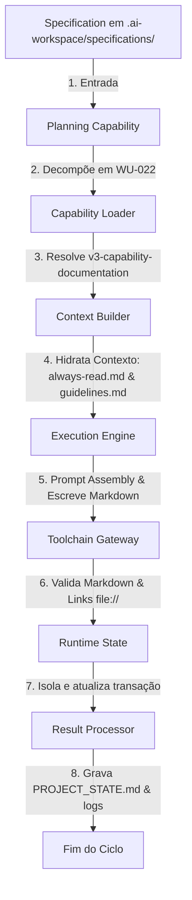

# Specification: Documentation Capability (v3-capability-documentation)

Esta especificação formal detalha as regras operacionais, o ciclo de execução na Framework Engine, o formato de comunicação (payloads) e as restrições da **Documentation Capability**.

---

## 🔄 Ciclo de Execução no Pipeline da Engine

O processamento de uma tarefa de documentação pela Engine segue o pipeline padrão linear, sem sofrer desvios por conta de papéis ou workflows dinâmicos:



### Detalhamento das Etapas do Fluxo

1. **Specification:** O desenvolvedor humano ou o Control Plane introduz um arquivo de especificação técnica em `.ai-workspace/specifications/` definindo o escopo documental desejado (ex: documentar uma API, atualizar o README de um módulo).
2. **Planning Capability:** Analisa a complexidade e cria uma Work Unit estruturada contendo o domínio `documentation`.
3. **Capability Loader:** Analisa a Work Unit e carrega deterministicamente a Capability `v3-capability-documentation` com base no domínio.
4. **Context Builder:** Filtra e carrega no prompt os arquivos obrigatórios ([always-read.md](file:///C:/Users/lucas/Projetos/Boilerplate-v2/.agents/rules/always-read.md) e [DOCUMENTATION_GUIDELINES.md](file:///C:/Users/lucas/Projetos/Boilerplate-v2/docs/guides/DOCUMENTATION_GUIDELINES.md)), bloqueando a injeção de qualquer arquivo em `src/` ou configurações.
5. **Execution Engine:** Constrói o prompt definitivo e escreve as mudanças físicas nos arquivos `.md` do repositório.
6. **Toolchain Gateway:** Executa checagens de sintaxe de markdown e valida se as referências cruzadas declaradas como links `file://` apontam para caminhos locais reais no computador do usuário.
7. **Runtime State:** Garante que a transação possua um UUID isolado e muda o estado operacional de `Executing` para `Validating`, e posteriormente para `Completed`.
8. **Result Processor:** Ao ler o status `PASS` da Toolchain, atualiza a lista de Work Units concluídas em [PROJECT_STATE.md](file:///C:/Users/lucas/Projetos/Boilerplate-v2/docs/history/PROJECT_STATE.md), gera o log em `.ai-workspace/logs/` e descarta a memória operacional.

---

## 📦 Payload Esperado

Abaixo está o esquema JSON representativo do payload trocado entre os módulos durante a invocação da capability:

```json
{
  "$schema": "http://json-schema.org/draft-07/schema#",
  "title": "DocumentationCapabilityPayload",
  "type": "OBJECT",
  "properties": {
    "transactionId": { "type": "STRING", "format": "uuid" },
    "workUnit": {
      "type": "OBJECT",
      "properties": {
        "id": { "type": "STRING", "pattern": "^WU-\\d+$" },
        "domain": { "type": "STRING", "enum": ["documentation"] },
        "title": { "type": "STRING" }
      },
      "required": ["id", "domain", "title"]
    },
    "runtimeInputs": {
      "type": "OBJECT",
      "properties": {
        "targetFilePath": { "type": "STRING" },
        "specificationSource": { "type": "STRING" }
      },
      "required": ["targetFilePath", "specificationSource"]
    }
  },
  "required": ["transactionId", "workUnit", "runtimeInputs"]
}
```

---

## 📥 Formato das Entradas (Inputs)

A Capability consome dois tipos de arquivos de entrada formatados em Markdown:
1. **Specifications de Documentação:** Devem conter seções claras de objetivos, estrutura de tópicos exigida e público-alvo da documentação a ser gerada.
2. **PROJECT_STATE.md:** Utilizado para extrair metadados e informações cronológicas do projeto para preenchimento de relatórios e changelogs.

---

## 📤 Formato das Saídas (Outputs)

Qualquer documento gerado ou atualizado pela Capability deve seguir a seguinte estrutura técnica:
1. **Formato Markdown Padrão:** Utilização estrita das marcações GitHub Flavored Markdown (GFM).
2. **Ausência de placeholders:** É proibido conter marcadores como `[Insira aqui]`, `TBD`, `TODO` ou textos genéricos.
3. **Links Clicáveis no Padrão do Framework:** Todas as referências a arquivos locais devem ser representadas no formato:
   Use texto descritivo e um caminho relativo válido para o arquivo Markdown.
4. **Semântica Acessível:** Respeitar a hierarquia de títulos (`<h1>` único, cabeçalhos consecutivos sem saltar níveis, ex: `h2` -> `h3`).

---

## 💡 Exemplos de Utilização

### Exemplo 1: Atualização do README.md de um componente
* **Entrada:** Solicitação de documentação detalhando o componente `Button`.
* **Ação:** A Capability analisa as propriedades do botão de forma passiva no código e escreve o `README.md` explicativo contendo seções de exemplos, parâmetros de propriedades e padrões de acessibilidade (foco, ARIA).
* **Resultado:** Arquivo markdown salvo na pasta correspondente.

### Exemplo 2: Geração de Relatório de Mudanças (Changelog)
* **Entrada:** Snapshot do `PROJECT_STATE.md` com a lista de Work Units concluídas na sprint.
* **Ação:** Consolidação dos metadados das tarefas e redação de um log cronológico estruturado.
* **Resultado:** Novo arquivo gerado em `.ai-workspace/logs/changelog-sprint.md`.

---

## 🚧 Limitações Operacionais

* **Sem Interação de Sistema:** A Capability é cega para a execução de códigos e comandos de sistema operacional; ela não pode rodar comandos em shells para validar lógicas de código.
* **Sem Escrita de Código:** Qualquer detecção de código modificado na pasta `src/` invalida instantaneamente a execução, disparando o fluxo de `Abort` e travando a Engine para auditoria humana.
* **Teto de Contexto:** A hidratação de contexto é limitada ao orçamento padrão de tokens. Arquivos de entrada excessivamente longos devem ser divididos ou resumidos pelo Context Builder antes do Prompt Assembly.
