# Fluxo Conceitual da Engine (Engine Flow) — AI Development Framework V3.0

Este documento apresenta a especificação do pipeline de execução do **AI Development Framework V3.0**. Ele descreve como a demanda estratégica do desenvolvedor humano transita de forma determinística pelas etapas lógicas da Framework Engine até ser consolidada de forma segura e validada no repositório.

---

## 🗺️ Pipeline Geral de Execução

```mermaid
graph LR
    Dev[Developer] -->|1. Alinhamento| Strat[Strategy]
    Strat -->|2. Formalização| Spec[Specification]
    Spec -->|3. Parsing| CP[Control Plane]
    CP -->|4. Hydration| CB[Context Builder]
    CB -->|5. Injeção| Cap[Capability]
    Cap -->|6. Codificação| Exec[Execution Engine]
    Exec -->|7. Compilação & Auditoria| TC[Toolchain]
    TC -->|8. Análise de Logs| RP[Result Processor]
    RP -->|9. Escrita de Snapshot| RS[Runtime State]
    RS -->|10. Entrega Homologada| Dev
```

---

## 🔄 Detalhamento das Transições do Fluxo

### 1. Developer ➔ Strategy
* **Descrição:** O desenvolvedor humano interage no Chat Externo contextualizando a demanda de negócio (uma nova funcionalidade, alteração estética, correção de lógica ou manutenção de dados).
* **Transição:** Conversa conceitual e alinhamento do escopo de engenharia.

### 2. Strategy ➔ Specification
* **Descrição:** A estratégia acordada é estruturada e convertida em um documento estático contendo diretrizes formais, caminhos, regras e limites da alteração.
* **Transição:** Preenchimento de templates formais e persistência em `.ai-workspace/specifications/`.

### 3. Specification ➔ Control Plane
* **Descrição:** O Control Plane consome e interpreta a especificação estruturada, quebrando a demanda em passos lógicos ordenados e criando o grafo de dependências conceituais.
* **Transição:** Inicialização do ciclo operacional e definição do plano de modificações.

### 4. Control Plane ➔ Context Builder
* **Descrição:** Com base no plano de passos lógicos, o Control Plane solicita a montagem do escopo de arquivos mínimos do repositório a serem lidos e alterados.
* **Transição:** Requisição de Context Hydration (Hidratação de Contexto).

### 5. Context Builder ➔ Capability
* **Descrição:** O Context Builder localiza os arquivos de código-fonte no repositório, cruza com as regras conceituais mínimas de desenvolvimento e seleciona as ferramentas e bibliotecas específicas para a tarefa.
* **Transição:** Vinculação da Capability técnica correspondente (ex: `write-ui`).

### 6. Capability ➔ Execution Engine
* **Descrição:** A Execution Engine recebe o payload de contexto contendo apenas os dados necessários acoplados à Capability correspondente para realizar o trabalho.
* **Transição:** Início do processamento cognitivo de modificação de arquivos.

### 7. Execution Engine ➔ Toolchain
* **Descrição:** A Execution Engine aplica as modificações conceituais e grava os arquivos físicos no repositório local. Em seguida, aciona de forma autônoma a toolchain local para verificar as mudanças.
* **Transição:** Submissão das alterações aos compiladores, linters e test runners locais.

### 8. Toolchain ➔ Result Processor
* **Descrição:** As ferramentas locais retornam os logs de build, linting e testes. O Result Processor recebe esses dados para julgar o resultado.
* **Transição:** Triagem conceitual e classificação de integridade.

### 9. Result Processor ➔ Runtime State
* **Descrição:** Caso o Toolchain confirme zero erros de compilação ou linting, o Result Processor autoriza a consolidação da mudança e dispara a gravação no estado.
* **Transição:** Atualização do snapshot do projeto no `PROJECT_STATE.md`.

### 10. Runtime State ➔ Developer
* **Descrição:** O ciclo é fechado de forma íntegra. O desenvolvedor humano recebe a confirmação detalhada do que foi alterado e validado de forma limpa, com o código compilado e pronto para uso.
* **Transição:** Entrega final homologada e sincronizada.
