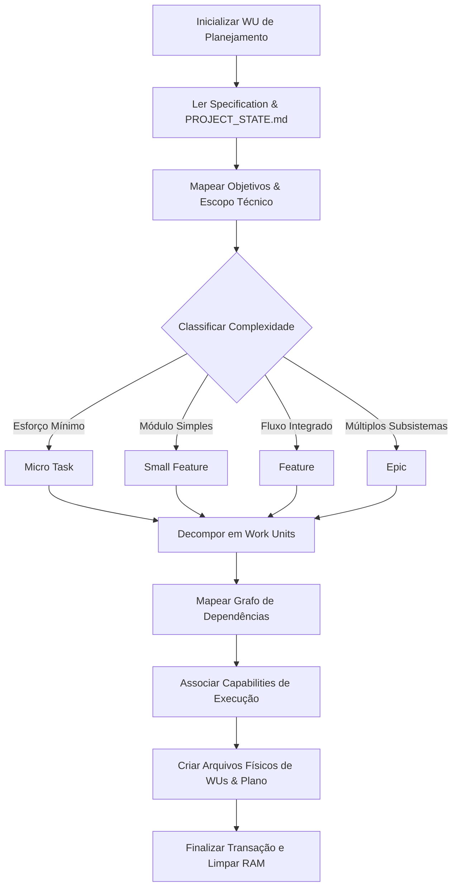

# Specification: Planning Capability Runtime (v3-capability-planning)

Esta especificação define o comportamento lógico, o fluxo de dados em tempo de execução, as limitações e os formatos de payloads de integração do módulo de planejamento em tempo de execução (**Planning Capability**).

---

## 📥 Entradas (Inputs)

O runtime da Planning Capability consome de forma passiva os seguintes arquivos de contexto de prompt:
1. **Specification de Requisitos:** Arquivo Markdown contendo a descrição funcional do escopo desejado em `.ai-workspace/specifications/[nome-da-feature].md`.
2. **Snapshot Operacional:** O arquivo [PROJECT_STATE.md](file:///C:/Users/lucas/Projetos/Boilerplate-v2/PROJECT_STATE.md) para sincronizar metadados e evitar a sobreposição de IDs de Work Units já executadas.
3. **Decisões Arquiteturais:** Arquivos ADR na pasta `.ai-workspace/decisions/` para alinhar o planejamento às diretrizes tecnológicas previamente aprovadas.

---

## 📤 Saídas (Outputs)

O runtime produz deterministicamente dois conjuntos de arquivos de texto:
1. **Plano de Execução Geral:** Arquivo de documentação consolidado detalhando riscos, premissas, ordem de execução e as capabilities associadas.
2. **Work Units Ativas:** Arquivos Markdown individuais gerados com base no template oficial da V3 e salvos em `.ai-workspace/specifications/active/` (ex: `wu-024-create-component.md`).

---

## 🔄 Fluxo de Processamento

A execução lógica da capability é composta pela esteira sequencial de processamento estruturado a seguir:



### Detalhamento Lógico do Fluxo

1. **Leitura e Extração:** O Context Builder injeta a especificação de entrada. A capability extrai o objetivo principal e delimita o escopo técnico.
2. **Classificação de Complexidade:** Aplica regras de triagem lógica para categorizar o esforço:
   * **Micro Task:** <= 1 dia de esforço lúdico, sem impactos em banco ou UI.
   * **Small Feature:** <= 2 dias de esforço, altera um componente ou rota simples.
   * **Feature:** <= 5 dias de esforço, envolve lógica integrada de UI, persistência ou API.
   * **Epic:** > 5 dias, envolve múltiplos subsistemas (deve ser dividido em múltiplos planos).
3. **Decomposição Atômica:** Quebra o escopo de forma vertical em fatias atômicas de trabalho, gerando arquivos de Work Unit individuais.
4. **Mapeamento de Dependências:** Organiza a ordem de execução cronológica. Cada Work Unit só pode ter dependências de WUs anteriores já concluídas ou no mesmo plano.
5. **Associação de Capabilities:** Resoluções estritas para associar as Capabilities registradas no [FRAMEWORK_INDEX.md](file:///C:/Users/lucas/Projetos/Boilerplate-v2/FRAMEWORK_INDEX.md).
6. **Emissão de Artefatos:** Grava fisicamente os arquivos de saídas sem interagir com arquivos de código.

---

## 🚧 Limitas e Regras de Bloqueio

* **Bloqueio de Escrita de Código:** Qualquer geração de código sintático (TypeScript, React, etc.) no output invalida imediatamente a execução, disparando rollback do Result Processor.
* **Teto de Complexidade:** Se a tarefa for classificada como **Epic**, a capability deve emitir um alerta técnico ao Control Plane recomendando a quebra em subespecificações antes de gerar as Work Units operacionais.
* **Isolamento de Memória:** O ID da Work Unit ativa de planejamento é limpo do Runtime State pós-escrita, prevenindo vazamento de contexto operacional para as Work Units que serão executadas a seguir.

---

## 📦 Exemplo de Payload de Integração

O payload JSON abaixo descreve os metadados trocados na inicialização do runtime do planejador:

```json
{
  "transactionId": "tx_plan_run_102",
  "workUnit": {
    "id": "WU-023",
    "domain": "planning",
    "title": "Decompor a especificação da tela de Login"
  },
  "runtimeInputs": {
    "targetSpecificationPath": "C:/Users/lucas/Projetos/Boilerplate-v2/.ai-workspace/specifications/auth-flow.md",
    "decisionsPath": "C:/Users/lucas/Projetos/Boilerplate-v2/.ai-workspace/decisions/"
  },
  "runtimeOutputs": {
    "status": "SUCCESS",
    "executionPlan": {
      "complexity": "Feature",
      "workUnitsCount": 2,
      "planPath": "C:/Users/lucas/Projetos/Boilerplate-v2/.ai-workspace/roadmaps/login-flow-plan.md"
    }
  }
}
```
