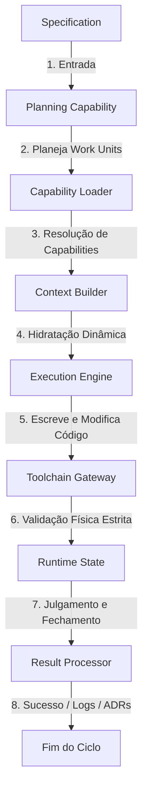

# Motor de Execução (Framework Engine) — V3.0

Este documento fornece a visão geral de alto nível do motor cognitivo e de controle da **Framework Engine V3.0**. Toda especificação técnica e detalhes lógicos operacionais de execução residem exclusivamente nos manuais dedicados de cada módulo.

---

## 🎯 Objetivo da Engine

O objetivo da Framework Engine é fornecer uma infraestrutura cognitiva desacoplada e determinística para desenvolvimento de software assistido por IA. Ela gerencia o ciclo de vida completo de modificações locais no código-fonte por meio de barramentos de controle de contexto, isolamento de memória operacional, validação física estrita por compiladores locais e tomada de decisão transacional automatizada.

---

## 🔄 Pipeline de Execução Resumido

O processamento transacional de desenvolvimento segue o seguinte fluxo linear de transições:

---

## 🏛️ Catálogo de Módulos e Documentações Associadas

Para obter especificações operacionais, limites, fluxos internos e diretrizes de auditoria detalhados de cada módulo, consulte seu respectivo manual proprietário:

1. **Planejamento de Tarefas:**
   * *Módulo:* `Control Plane` / `Planning Capability`
   * *Manual Proprietário:* [.agents/capabilities/planning.md](file:///C:/Users/lucas/Projetos/Boilerplate-v2/.agents/capabilities/planning.md)
   * *Especificações:* [.ai-workspace/specifications/work-unit-definition.md](file:///C:/Users/lucas/Projetos/Boilerplate-v2/.ai-workspace/specifications/work-unit-definition.md)
2. **Resolução de Capabilities:**
   * *Módulo:* `Capability Loader`
   * *Manual Proprietário:* [.agents/capabilities/capability-loader.md](file:///C:/Users/lucas/Projetos/Boilerplate-v2/.agents/capabilities/capability-loader.md)
   * *Especificações:* [.ai-workspace/specifications/capability-lifecycle.md](file:///C:/Users/lucas/Projetos/Boilerplate-v2/.ai-workspace/specifications/capability-lifecycle.md)
3. **Gerenciamento de Contexto:**
   * *Módulo:* `Context Builder`
   * *Manual Proprietário:* [.agents/capabilities/context-builder.md](file:///C:/Users/lucas/Projetos/Boilerplate-v2/.agents/capabilities/context-builder.md)
   * *Especificações:* [.ai-workspace/specifications/context-selection.md](file:///C:/Users/lucas/Projetos/Boilerplate-v2/.ai-workspace/specifications/context-selection.md)
4. **Escrita Física de Código:**
   * *Módulo:* `Execution Engine`
   * *Manual Proprietário:* [FRAMEWORK_EXECUTION.md](file:///C:/Users/lucas/Projetos/Boilerplate-v2/FRAMEWORK_EXECUTION.md)
   * *Especificações:* [.ai-workspace/specifications/execution-runtime.md](file:///C:/Users/lucas/Projetos/Boilerplate-v2/.ai-workspace/specifications/execution-runtime.md)
5. **Auditoria Sintática Local:**
   * *Módulo:* `Toolchain Gateway`
   * *Manual Proprietário:* [FRAMEWORK_TOOLCHAIN.md](file:///C:/Users/lucas/Projetos/Boilerplate-v2/FRAMEWORK_TOOLCHAIN.md)
   * *Especificações:* [.ai-workspace/specifications/toolchain-runtime.md](file:///C:/Users/lucas/Projetos/Boilerplate-v2/.ai-workspace/specifications/toolchain-runtime.md)
6. **Memória Operacional Volátil:**
   * *Módulo:* `Runtime State`
   * *Manual Proprietário:* [FRAMEWORK_RUNTIME.md](file:///C:/Users/lucas/Projetos/Boilerplate-v2/FRAMEWORK_RUNTIME.md)
   * *Especificações:* [.ai-workspace/specifications/runtime-state.md](file:///C:/Users/lucas/Projetos/Boilerplate-v2/.ai-workspace/specifications/runtime-state.md)
7. **Consolidação e Fechamento:**
   * *Módulo:* `Result Processor`
   * *Manual Proprietário:* [FRAMEWORK_RESULT_PROCESSOR.md](file:///C:/Users/lucas/Projetos/Boilerplate-v2/FRAMEWORK_RESULT_PROCESSOR.md)
   * *Especificações:* [.ai-workspace/specifications/result-processing.md](file:///C:/Users/lucas/Projetos/Boilerplate-v2/.ai-workspace/specifications/result-processing.md)
