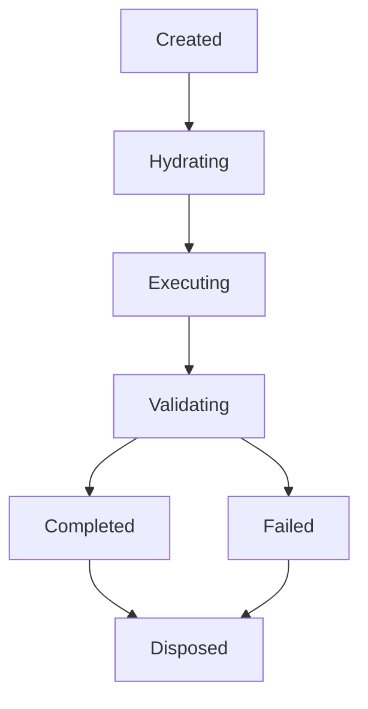

# Especificação de Memória Operacional e Runtime State — AI Development Framework V3.0

Este documento define a especificação oficial e o manual do **Runtime State** da versão 3.0 do framework. O Runtime State é o mecanismo de memória volátil em tempo de execução que monitora e isola uma única transação de desenvolvimento executada pela Framework Engine.

---

## 🎯 Objetivo

O objetivo do Runtime State é servir como a memória de curto prazo (RAM) de uma execução específica. Ele impede o fenômeno de **Context Drift** (deriva de contexto, onde ideias de tarefas passadas contaminam o desenvolvimento da tarefa atual) e garante isolamento absoluto entre execuções lógicas consecutivas.

---

## 🏛️ Runtime Principles (Princípios do Runtime)

1. **Stateless Between Executions (Sem Estado Compartilhado):** Nenhuma execução compartilha ou reutiliza o buffer de memória da execução anterior.
2. **Minimal Runtime (Contexto Mínimo):** O Runtime contém estritamente as variáveis operacionais e caminhos necessários para a Work Unit ativa.
3. **Disposable Memory (Memória Descartável):** O buffer é inicializado no início da tarefa e completamente apagado após a auditoria do Result Processor.
4. **No Historical Knowledge (Sem Conhecimento Histórico):** Histórico de longo prazo pertence aos Logs, ADRs e ao `PROJECT_STATE.md`. O Runtime é puramente imediato.
5. **Execution Isolation (Isolamento de Execução):** Falhas críticas ou interrupções em uma execução jamais contaminam as variáveis de estado da próxima chamada.
6. **Deterministic Runtime (Determinismo):** Duas execuções alimentadas pela mesma especificação e pelo mesmo payload de contexto devem produzir exatamente o mesmo estado lógico resultante.

---

## 🔄 Runtime State Machine (Máquina de Estados)

O ciclo de transição de estado da memória operacional segue os seguintes estados conceituais:

### Detalhamento das Transições:
* **Created (Criado):** O estado é inicializado com um UUID exclusivo assim que o Control Plane aprova o início de uma Work Unit.
* **Hydrating (Hidratando):** O Context Builder injeta a lista de arquivos a serem carregados e calcula o orçamento de tokens.
* **Executing (Executando):** A Execution Engine realiza as alterações físicas, registrando a lista de arquivos alterados e pendentes.
* **Validating (Validando):** O Toolchain Gateway rodando localmente audita sintaticamente as saídas físicas, gravando avisos ou erros.
* **Completed (Concluído):** O Result Processor valida o código com sucesso e consolida o snapshot.
* **Failed (Falha):** Erros de compilação persistem após retentativas, disparando rollback físico do repositório.
* **Disposed (Descartado):** Toda a memória em tempo de execução é expurgada do buffer cognitivo da IA, finalizando o processo.

---

## 🛠️ Escopo Operacional e Garantias

* **Estratégia de Isolamento:** Cada transação opera em um thread lógico isolado de dados, bloqueando qualquer injeção de parâmetros de tarefas passadas.
* **Estratégia de Descarte:** O descarte ocorre por meio da limpeza completa do buffer de memória do prompt da IA. As regras da Capability inativa são expurgadas, restando apenas o repositório físico atualizado.
* **Casos Inválidos:** Tentativa de persistir dados no Runtime State que ultrapassem a Work Unit ativa ou vazamento de UUIDs de sessões anteriores suspendem a execução.
