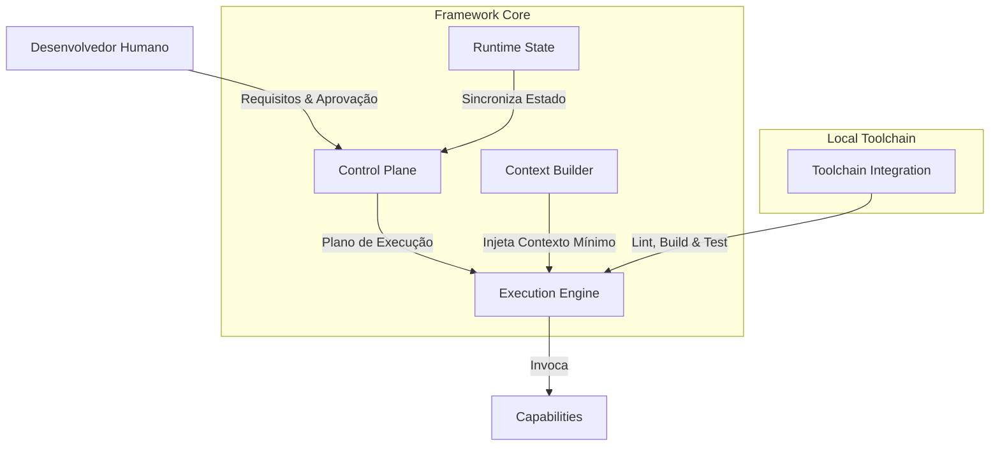
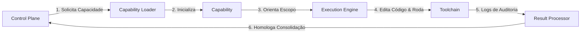
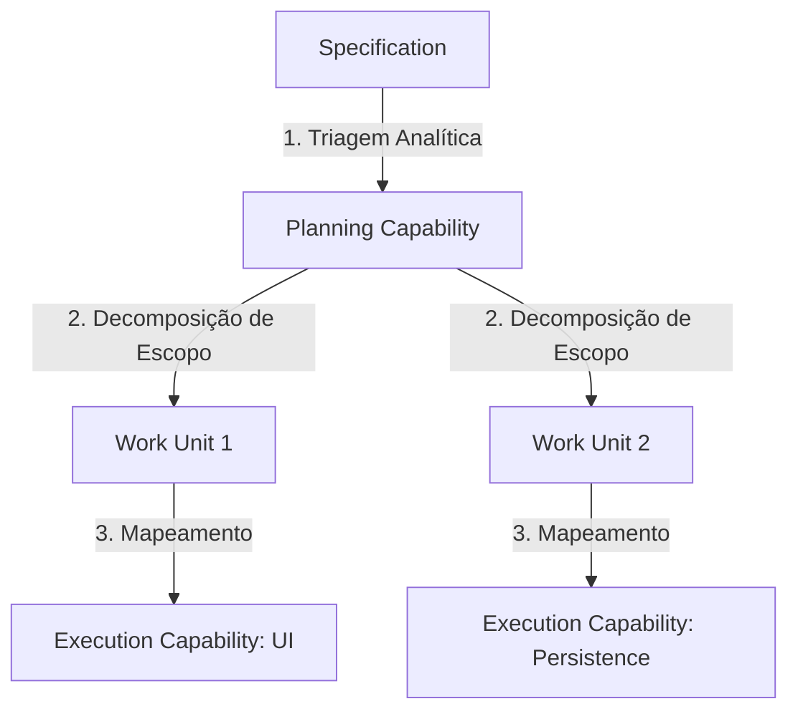
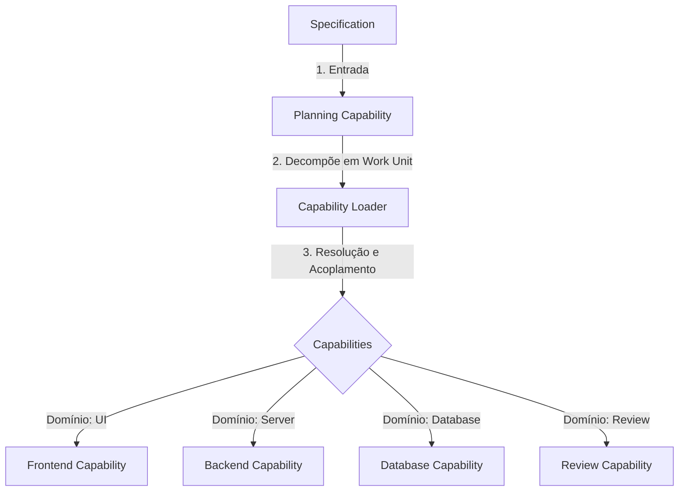
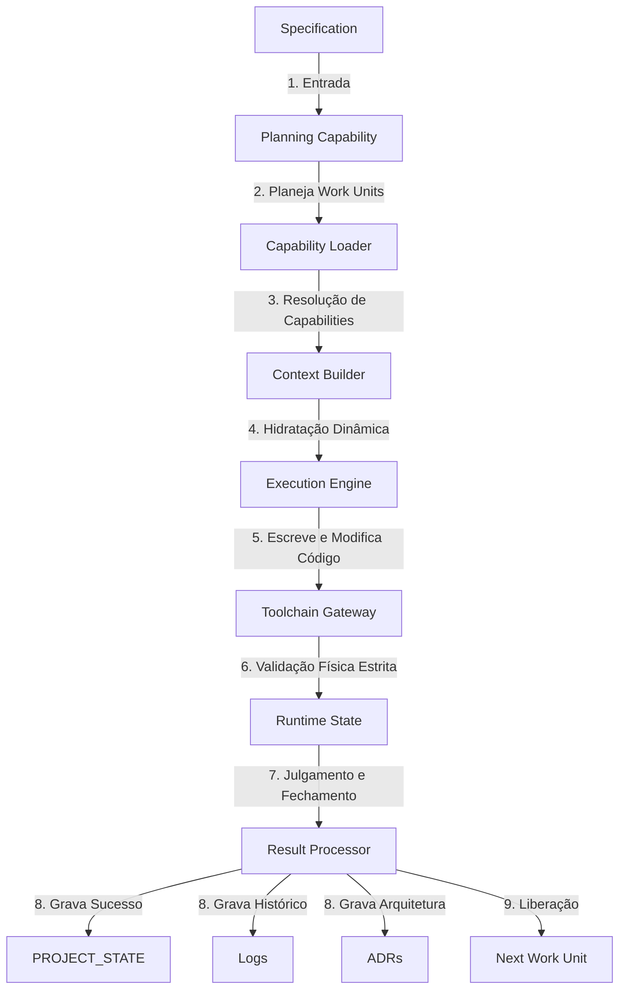

# Arquitetura AI Development Framework V3.0 — Especificação Oficial

Este documento define a especificação oficial e a direção arquitetural para a versão 3.0 do **AI Development Framework**. Esta versão representa uma transição de paradigma: saímos de um modelo focado em papéis/simulação de equipe (V2) para uma arquitetura baseada em capacidades cognitivas puras, orquestradas por motores de execução determinísticos.

---

## 🎯 Propósito da V3

O propósito da V3.0 é estabelecer uma fundação robótica de desenvolvimento de software assistido por IA que elimine a sobrecarga de encenação de papéis (personas) e o consumo indevido de tokens de contexto. A arquitetura passa a tratar a inteligência artificial como uma **Engine Cognitiva de Execução** que consome capacidades sob demanda, guiada por um plano de controle semântico.

---

## 🚀 Objetivos

* **Eliminação de Personas:** Remover a necessidade de simulação de "equipes" ou "roles" (ex: manager, frontend, backend), focando em *Capabilities* (capacidades operacionais).
* **Consumo de Contexto Minimalista:** Otimizar agressivamente o contexto injetado a cada chamada usando construtores dinâmicos de estado e contexto.
* **Deterministic Execution:** Garantir que o comportamento da IA siga padrões lógicos reproduzíveis através de uma Toolchain e uma Engine de Execução integradas.
* **Arquitetura Desacoplada:** Separar a inteligência analítica (Control Plane) da execução física no repositório (Execution Engine).

---

## 💎 Princípios

1. **Capabilities Over Personas:** A IA não finge ser um desenvolvedor; ela invoca a capacidade técnica necessária (ex: `write_ui`, `refactor_logic`, `validate_lint`) para a tarefa.
2. **Context on Demand:** O contexto é montado dinamicamente no momento da execução, contendo apenas o estritamente necessário para o escopo da tarefa atual.
3. **State Integrity:** O estado do projeto e da execução é persistido e versionado em tempo de execução (*Runtime State*), garantindo consistência operacional permanente.
4. **Toolchain Empowerment:** A IA delega tarefas repetitivas ou de validação sintática direta para ferramentas automáticas locais (compiladores, linters, testes).

---

## 🔄 Diferenças Entre V2 e V3

| Característica | Versão 2.1.1 (V2) | Versão 3.0 (V3) |
| :--- | :--- | :--- |
| **Abstração Base** | Perfis e Papéis (`roles/` ex: manager, frontend) | Capacidades Técnicas (`capabilities/` ex: logic, ui) |
| **Execução** | Baseada em Workflows passo a passo manuais | Baseada em um motor determinístico (`Execution Engine`) |
| **Orquestração** | Simulação de equipe (Manager delega para Executor) | Plano de controle semântico unificado (`Control Plane`) |
| **Contexto** | Mapa de Contexto estático (`FRAMEWORK_INDEX.md`) | Construtor de Contexto dinâmico (`Context Builder`) |
| **Estado** | Snapshot Operacional estático (`PROJECT_STATE.md`) | Gerenciamento de estado de execução ativo (`State`) |

---

## 💡 Nova Filosofia do Framework

A filosofia central da V3 baseia-se na **Engine Cognitiva Semântica**. O Framework não é mais um conjunto de diretrizes de leitura para agentes simulados, mas sim um protocolo de comunicação entre o Desenvolvedor Humano, o **Control Plane** (inteligência de planejamento), e a **Execution Engine** (inteligência de codificação), que operam através de uma **Toolchain** local.

---

## 🎭 Matriz de Responsabilidades

### 1. Responsabilidades da IA (Control Plane & Execution Engine)
* **Control Plane:** Analisar requisitos do usuário, planejar as modificações necessárias e estruturar o grafo de execução técnica sem implementar código diretamente.
* **Execution Engine:** Consumir as *Capabilities* solicitadas para realizar as alterações no código-fonte de forma focada, mantendo o menor impacto possível no contexto.

### 2. Responsabilidades da Toolchain
* **Validação Sintática:** Executar linters, formatadores e analisadores estáticos locais de forma autônoma.
* **Validação Semântica:** Executar testes unitários e de integração locais para validar o comportamento do código.
* **Compilação:** Garantir que o build do projeto esteja íntegro após cada ciclo de alteração.

### 3. Responsabilidades do Framework
* **Context Builder:** Reunir dinamicamente as regras absolutas, bases de conhecimento técnico e trechos do código afetados para montar o payload mínimo de contexto.
* **State Management:** Monitorar o estado de progresso das tarefas de forma transacional, revertendo em caso de falha de validação da Toolchain.

### 4. Responsabilidades do Desenvolvedor (Humano)
* **Alinhamento Estratégico:** Fornecer os requisitos de negócio e especificações de features.
* **Revisão e Aprovação:** Aprovar ou rejeitar as alterações arquiteturais propostas e chancelar os releases na Toolchain.
* **Definição de Fronteiras:** Controlar os privilégios e acessos das ferramentas automáticas.

---

## 🗺️ Visão Geral da Arquitetura (Conceitual)

## ⚙️ Engine Overview (Visão Geral da Engine)

A **Framework Engine** é o núcleo de execução que operacionaliza a arquitetura V3.0 através da interação integrada dos seguintes módulos:

* **Control Plane:** Mapeia e traduz especificações estáticas em um grafo estruturado de passos lógicos de modificação.
* **Execution Engine:** Consome capacidades técnicas e escreve os códigos fontes reais nos arquivos do repositório.
* **Context Builder:** Executa o algoritmo de *Context Hydration* para prover somente a carga útil necessária para a Execution Engine.
* **Capability Loader:** Carrega as regras e configurações atômicas de codificação sob demanda.
* **Runtime State:** Registra a evolução transacional de progresso e tarefas de forma consistente no repositório.
* **Toolchain Gateway:** Faz a interface com ferramentas de terminal locais para rodar testes, formatadores e linters de forma autônoma.
* **Result Processor:** Analisa os retornos da Toolchain e determina se consolida a alteração no repositório ou aciona correções na Execution Engine.

### 🔄 Pipeline de Acoplamento de Capabilities

### 📋 Grafo de Decomposição de Tarefas (Planning)

### 🧭 Fluxo de Resolução e Seleção de Capabilities

### 🚀 Pipeline Definitivo de Execução da Engine

---

> **Status da Arquitetura:** ARCHITECTURE FROZEN (Pronta para o início da implementação conceitual na próxima fase).
